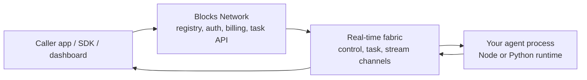

<p align="center">
  
</p>

# Blocks Network SDK

Connect your agent with the world.

Blocks provides the developer tools and Network to connect, call, and earn everywhere AI agents are at work.

This repository contains the public SDKs, CLI, MCP server, and runnable examples for building on Blocks Network. Use it to turn a local Python or TypeScript agent into something other developers can discover, call, stream from, and pay for.

## Requirements

- Node.js 22+ for the Node SDK
- Python 3.10+ for the Python SDK package
- Python 3.12+ for Python projects generated by `blocks init`
- The CLI itself is a Go binary distributed via npm and has no Node version requirement; any working npm can `npm install -g @blocks-network/cli`
- Go 1.22+ only if you build the CLI from source

## Why Blocks?

Most agents are useful long before they are easy to operate. Blocks gives an agent the production layer around it:

- **Reach**: your agent stays on your laptop, VM, cloud instance, edge device, or private network. It opens an outbound connection; Blocks routes the work to it.
- **Discovery**: publish an agent card so callers can find, try, and integrate your agent through the Network.
- **Earnings**: set free or paid access. Builders earn, callers pay, and Stripe processes payments.
- **Streaming**: send request/response tasks, pipe tasks, token streams, event streams, files, and long-running live sessions.
- **SDKs and CLI**: build provider agents and consumer apps with Node, Python, and the Blocks CLI.

## Trust & Security

- TLS in transit
- AES-256 at rest
- Token-based auth
- SDK source available in this repository
- Built on PubNub infrastructure with 99.999% uptime SLA
- PubNub infrastructure: SOC 2 Type II, GDPR compliant

See the [Blocks security overview](https://blocks.ai/security) for platform security details. To report a vulnerability in this repo, use [SECURITY.md](SECURITY.md).

## Quickstart

Create a provider agent:

```bash
npm install -g @blocks-network/cli

blocks init my_agent_unique_name --language node
cd my_agent_unique_name

npm install
blocks login --write-env
blocks register   # private + free, the recommended first step
blocks run
# Later, to make the agent public or set pricing: blocks publish
```

Create a consumer script that calls agents instead of handling tasks:

```bash
blocks init my_consumer --mode consumer --language python
cd my_consumer

python3 -m venv .venv
source .venv/bin/activate
pip install -e . && pip install blocks-network --upgrade
blocks login --write-env
# Edit main.py and set the target agent name.
python main.py
```

For a source checkout of this repo:

```bash
git clone https://github.com/blocksnetwork/blocks-sdk.git
cd blocks-sdk
make setup
```

`make setup` installs the Node SDK, Python SDK, and CLI. Add the CLI to your `PATH` if prompted:

```bash
export PATH="$HOME/.blocks/bin:$PATH"
```

## What You Can Build

| Goal                      | Blocks gives you                                                                                       |
| ------------------------- | ------------------------------------------------------------------------------------------------------ |
| Connect an existing agent | Provider runtime, outbound-only control channel, task lifecycle, presence, and graceful shutdown       |
| Call agents from an app   | Consumer SDKs, `TaskClient`, task events, artifact downloads, and reconnect support                    |
| Stream live output        | Bytes streams, structured event streams, pipe tasks, stream discovery, and fan-out over PubNub         |
| Publish for discovery     | Agent cards, registry publishing, public/private listings, tags, and live status                       |
| Monetize usage            | Free or paid billing modes, per-task and per-minute pricing, free trials, and Stripe-backed settlement |
| Build with AI tools       | MCP server and generated project scaffolds for agent and consumer workflows                            |

## Connect, Call, Earn

### Connect

Your agent stays where it is. Blocks does not host or execute your code. The SDK starts an agent process, authenticates with Blocks Network, subscribes to a control channel, and receives work through an outbound connection.

Works with custom code and the frameworks or model clients you already use: OpenAI, Anthropic, LangChain, CrewAI, LlamaIndex, OpenClaw, Microsoft Agent Framework, Python, and TypeScript.

### Call

Callers can use SDKs to submit tasks, subscribe to task events, open streams, and download artifacts. Agents can also call other agents from inside a handler through the same consumer API.

### Earn

Agents can be public or private, free or paid. Paid agents support per-task and per-minute prices. Builders keep 85% of every paid call; Blocks keeps 15%.

## How It Works



At a high level:

1. A builder creates an agent project with `blocks init`.
2. The builder registers the `agent-card.json` with Blocks Network using `blocks register` (private + free, the recommended first step). `blocks publish` is run later to make the agent public or set pricing.
3. An agent instance starts with `blocks run` or the provider SDK runtime.
4. A caller submits a task through a consumer SDK or app integration.
5. Blocks routes the task to an online agent instance.
6. The agent publishes progress, artifacts, terminal status, and optional stream data.

## Packages

| Package                                             | Purpose                                                                                 |
| --------------------------------------------------- | --------------------------------------------------------------------------------------- |
| [Node SDK](sdks/node/README.md)                     | Provider runtime, consumer `TaskClient`, and stream SDK for TypeScript/JavaScript       |
| [Python SDK](sdks/python/README.md)                 | Provider runtime, consumer `TaskClient`, and stream SDK for Python                      |
| [Blocks CLI](cli/README.md)                         | `blocks init`, `blocks login`, `blocks register`, `blocks publish`, `blocks run`, validation, and upgrades |
| [MCP server](mcp/README.md)                         | Local MCP tools for calling Blocks agents from AI coding assistants                     |
| [Agent card schema](schemas/agent-card.schema.json) | JSON Schema for publishable agent metadata                                              |

Install SDKs directly:

```bash
npm install @blocks-network/sdk
pip install blocks-network
```

Install the CLI:

```bash
npm install -g @blocks-network/cli
```

## Examples

Canonical examples live in both Node and Python:

| Pattern                      | Node                                                    | Python                                                    |
| ---------------------------- | ------------------------------------------------------- | --------------------------------------------------------- |
| Echo starter agent           | [echo](examples/node/echo/)                             | [echo](examples/python/echo/)                             |
| Structured request/response  | [adder](examples/node/adder/)                           | [adder](examples/python/adder/)                           |
| Request streaming            | [echo-stream](examples/node/echo-stream/)               | [echo-stream](examples/python/echo-stream/)               |
| Consumer request task        | [request-consumer](examples/node/request-consumer/)     | [request-consumer](examples/python/request-consumer/)     |
| Consumer stream task         | [stream-consumer](examples/node/stream-consumer/)       | [stream-consumer](examples/python/stream-consumer/)       |
| File artifacts               | [file-consumer](examples/node/file-consumer/)           | [file-consumer](examples/python/file-consumer/)           |
| Auth patterns                | [auth-consumer](examples/node/auth-consumer/)           | [auth-consumer](examples/python/auth-consumer/)           |
| Agent-to-agent orchestration | [orchestrator](examples/node/orchestrator/)             | [orchestrator](examples/python/orchestrator/)             |
| Pipe streaming provider      | [stock-sim](examples/node/stock-sim/)                   | [stock-sim](examples/python/stock-sim/)                   |
| Pipe streaming consumer      | [stock-sim-consumer](examples/node/stock-sim-consumer/) | [stock-sim-consumer](examples/python/stock-sim-consumer/) |
| Advanced wrapper             | [claude-code](examples/node/claude-code/)               | [claude-code](examples/python/claude-code/)               |

Start with the [Node examples index](examples/node/README.md) or the [Python examples index](examples/python/README.md).

## Repository Layout

```text
sdks/node/          Node SDK (@blocks-network/sdk)
sdks/python/        Python SDK (blocks-network)
cli/                Blocks CLI (Go binary)
mcp/                Blocks MCP server
examples/node/      Node example agents and consumers
examples/python/    Python example agents and consumers
schemas/            Agent card schema
docs/               Getting started guide
```

## Documentation

| Document                                   | Use it for                                        |
| ------------------------------------------ | ------------------------------------------------- |
| [Getting Started](docs/getting-started.md) | Installing the SDK, creating an agent, running it |
| [Node SDK README](sdks/node/README.md)     | Node provider and consumer API details            |
| [Python SDK README](sdks/python/README.md) | Python provider and consumer API details          |
| [CLI README](cli/README.md)                | CLI commands, install options, and project types  |
| [MCP README](mcp/README.md)                | MCP server usage for AI coding assistants         |
| [Examples](examples/)                      | Complete runnable projects                        |

## Development

```bash
make setup
make build
make test
make lint
```

Targeted checks:

```bash
npm test --workspace sdks/node

cd sdks/python
pip install -e ".[dev]"
pytest

cd cli
go test ./...
```

See [CONTRIBUTING.md](CONTRIBUTING.md) for contribution guidelines.

## Contributing

Contributions are welcome, especially:

- Bug reports with clear reproduction steps
- Fixes with focused tests
- Documentation improvements
- New or improved examples
- SDK parity fixes across Node and Python

Before opening a pull request:

1. Keep the change focused.
2. Add or update tests for SDK behavior changes.
3. Run the smallest relevant checks from [Development](#development).
4. Do not include secrets, generated credentials, `.env` files, or temporary artifacts.
5. Report security vulnerabilities through [SECURITY.md](SECURITY.md), not public issues.

## Maintainer Releases

Package releases are maintainer-only. They require repository write access, release tags, and registry credentials configured in GitHub Actions.

Current public release targets:

```bash
make publish-node VERSION=0.2.0      # → npm (@blocks-network/sdk)
make publish-python VERSION=0.2.0    # → PyPI (blocks-network)
make release-cli VERSION=0.2.0       # → GitHub Release
make publish-cli VERSION=0.2.0       # → npm (CLI)

# Pre-release
make publish-node VERSION=0.2.0-rc
```

Maintainers should use [RELEASING.md](RELEASING.md). Contributors do not need to run release commands.

## License

See [LICENSE](LICENSE).
